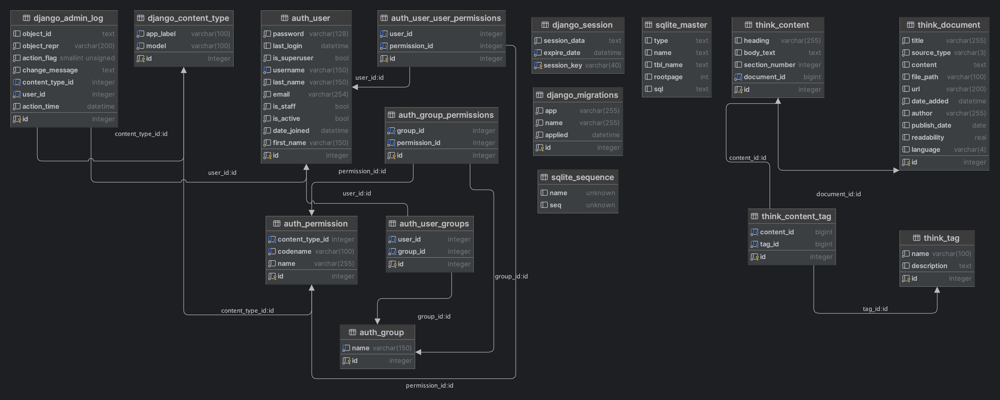

# MirageXR Backend

This backend serves as an integral component of [MirageXR](https://github.com/WEKIT-ECS/MIRAGE-XR), specifically 
designed to facilitate dialogues through various Large Language Models (LLMs), Speech-To-Text (STT), and Text-To-Speech 
(TTS) models. It also incorporates Retrieval-Augmented Generation (RAG) patterns and manages a data pipeline for storing 
documents within a corpus, enhancing the dialogue experience in virtual and augmented reality settings.

## Table of Contents

- [Introduction](#introduction)
- [Endpoints and Features](#features)
- [License](#license)

## Introduction

The MirageXR Backend extends the capabilities of the MirageXR project by adding advanced dialogue functionalities. 
It serves as a wrapper around different LLMs, STT, and TTS models, providing endpoints that incorporate RAG patterns 
for dynamic conversation flows. The backend also includes a data pipeline to manage and store various documents within 
a corpus, making it a versatile tool for dialogue management in XR environments.

## Features

### Endpoints:

- `/listen`: Accepts an MP3 file and returns a transcript using various Whisper models.
- `/options`: Offers a JSON response detailing the available models.
- `/speak`: Converts text into speech.
- `/think`: Supports three different LLM models: GPT-3.5, GPT-4, and the RAG Model.

### Data Pipeline:

- Processes and stores content from PDF, TXT, and CSV files in a database, making it accessible for the RAG Model. 
- All documents in /data/ will be processed. With the command `data` the data will be processed and uploaded to the database. An additional analysis can be run with the command `analyze_data`. 

### Database 

## License

This project is licensed under the MIT License - see the [LICENSE](LICENSE) file for details.