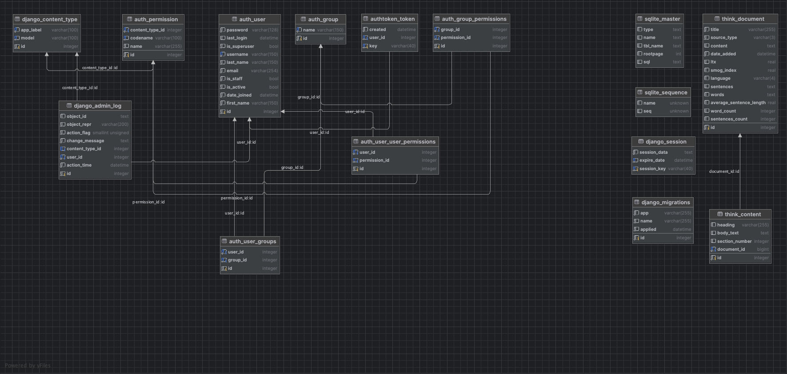
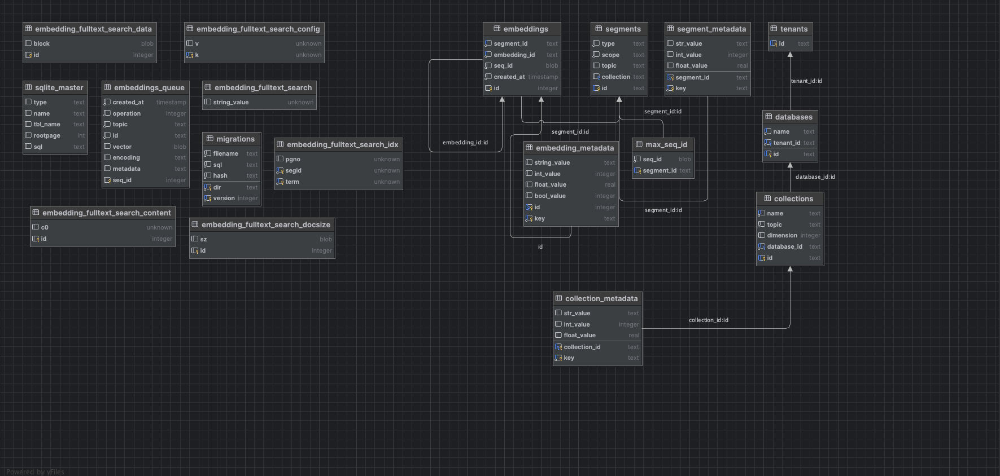

# MirageXR AI Services

This server backend implements a facade to AI services, providing a wrapper to [MirageXR](https://github.com/WEKIT-ECS/MIRAGE-XR), 
specifically to facilitate dialogue interaction with Large Language Models (LLMs) using Speech-To-Text (STT) and Text-To-Speech 
(TTS) services. LLM interaction follows the Retrieval-Augmented Generation (RAG) pattern, see [Lewis et al.](https://arxiv.org/abs/2005.11401),
and manages a data pipeline for storing documents as corpora, enhancing the dialogue experience in eXtended Reality settings.

## Table of Contents

- [Introduction](#introduction)
- [Endpoints and Features](#features)
- [License](#license)

## Introduction

The MirageXR AI service backend extends the capabilities of the MirageXR project by adding a wrapper to external AI services 
for advanced dialogue functionalities. It serves as a facade to different LLMs, STT, and TTS models, providing endpoints 
that incorporate RAG patterns for dynamic conversation flow. The backend also includes a data pipeline to manage and store 
various documents within a corpus, making it a versatile tool for dialogue management in XR environments.

## Features

### Endpoints:

- **`admin/`**: Django Admin UI
  - **Note**: Should be deactivated before the server is deployed to ensure security.
- **`speak/`**: Text-to-Speech Conversion
  - Converts provided text into speech. Supports various configurations for voice and language.
- **`listen/`**: Audio to Text Transcription
  - Accepts audio files in MP3, WAV, and OGG formats. Returns a transcript using Whisper models.
- **`think/`**: Large Language Model (LLM) Operations
  - Supports three different LLM models: GPT-3.5, GPT-4, and the RAG Model. Can perform a variety of NLP tasks.
- **`options/`**: Model Options Inquiry
  - Offers a JSON response detailing the available models.
- **`authentication/`**: API Authentication
  - Provides an API token for authenticated access. Requires a valid user account.

- A set of Postman request configurations is available for testing the API endpoints. These can be found in the `./postman_test_request` directory of the project repository.

### Data Pipeline:

- Processes and stores content from PDF, TXT, and CSV files in a database, making it accessible for RAG. 
- All documents in /data/ will be processed. With the command `data`, the data will be uploaded  and processed to the database and will be embedded and analyzed.

### # Project Databases Configuration

In the project, two databases are utilized:

1. **Django's Default Database**: This database is used to store information from documents. It leverages Django's out-of-the-box database management capabilities to handle data persistence and retrieval efficiently.

2. **Chroma Framework Database**: For managing embeddings, an additional database generated by the Chroma framework is used. This specialized database is designed to optimize the storage and querying of embedding vectors, enhancing the project's performance in handling complex data operations.

Django DB 

ChromaDB

### Set up
1. Clone the project.
2. If not done install pip
3. Run python -m venv venv in the project directory
4. Activate the Virtual Environment -- On Windows: .\venv\Scripts\activate -- On macOS or Linux: source venv/bin/activate
5. Install with pip all the dependencies: `pip install -r requirements.txt`
6. Set up an environment: Create a `backend/.env` file with the field `OPENAI_API_KEY=$your_key`.
7. `cd backend`
8. Run the Django server with `python manage.py runserver 8000 &`.
9. Set up the database with `python manage.py makemigrations think` and `python manage.py makemigrations document`
10. and `python manage.py migrate`.
11. Create a superuser with `python manage.py createsuperuser`.
12. Access the backend via `http://127.0.0.1:8000/admin/`, and create a new user (optional) and an authentication token, to be used with the API request.
13. You can test the System with `python manage.py test`. 
14. You can upload document for a RAG Model via the `/document/` endpoint and set up the Configuration use the `/document/configuration` endpoint.
15. To send your request (e.g., via Postman) and include the key in the header with the line key `Authorization` set to `Token $key`.

## License

This project is licensed under the MIT License - see the [LICENSE](LICENSE) file for details.
