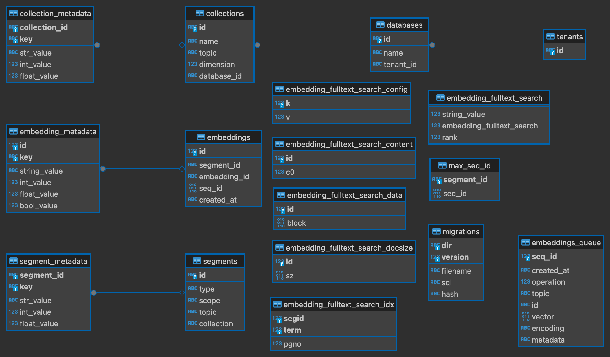

# MirageXR AI Services

This server backend implements a facade to AI services, providing a wrapper to [MirageXR](https://github.com/WEKIT-ECS/MIRAGE-XR), 
specifically to facilitate dialogue interaction with Large Language Models (LLMs) using Speech-To-Text (STT) and Text-To-Speech 
(TTS) services. LLM interaction follows the Retrieval-Augmented Generation (RAG) pattern, see [Lewis et al.](https://arxiv.org/abs/2005.11401),
and manages a data pipeline for storing documents as corpora, enhancing the dialogue experience in eXtended Reality settings.
A minimal frontend for the setup of an agent and the document upload it also provide by us. Your can find it 
[here](https://github.com/AKissMail/MIRAGEXR_AgentBuilder). The frontend is still a work in progress, so expect bug and 
be so kind to report them here. 

## Table of Contents

- [Introduction](#introduction)
- [Endpoints and Features](#features)
- [License](#license)

## Introduction

The MirageXR AI service backend extends the capabilities of the MirageXR project by adding a wrapper to external AI services 
for advanced dialogue functionalities. It serves as a facade to different LLMs, STT, and TTS models, providing endpoints 
that incorporate RAG patterns for dynamic conversation flow that is context aware. The backend also includes a data 
pipeline to manage and store various documents within a corpus, making it a versatile tool for dialogue management in 
XR environments. The Backend can process PDF, TXT, HTML and CSV files. We recommend to use PDF, HTML and TXT since the 
CSV feacher is an experimental and can lead to unexpected outputs.

At the moment the Project has an focus otn the use case of second language aqustion for Norwegan leaners. With that focus 
some fetchers are included the datapiplien that mai dose not work well in other lunagedeges like a LTX score.  

## Features

### Endpoints:

- **`admin/`**: Django Admin UI
  - **Note**: Should be deactivated before the server is deployed to ensure security.
- **`speak/`**: Text-to-Speech Conversion
  - Converts provided text into speech. Supports various configurations for voice and language.
- **`listen/`**: Audio to Text Transcription
  - Accepts audio files in MP3, WAV, and OGG formats. Returns a transcript using Whisper models.
- **`think/`**: Large Language Model (LLM) Operations
  - Supports three different LLM models: GPT-3.5, GPT-4, and the RAG Model. Can perform a variety of NLP tasks.
- **`options/`**: Model Options Inquiry
  - Offers a JSON response detailing the available models.
- **`authentication/`**: Authentication API
  - Provides an API token for authenticated access. Requires a valid user account.
- **`document/`**: 
  - Provides an endpoint to upload document to a specific RAG model
- **`document/configuration/`**: 
  - Provides an endpoint to upload a configuration for an agent

### Data Pipeline:

- Processes and stores content from PDF, TXT, HTML, and CSV files in a database, making it accessible for RAG. 
- We extract the content of the document out of the provided fiel and dived them in to chunks with around 200 characters. 
- Depending on the chooses RAG model embedded will be calculated and the document will add to the database.

### # Project Databases Configuration

In the project, two databases are utilized:

1. **Django's Default Database**: This database is used to store information from documents and embedding for the FAISS 
and Jaccard RAG model. It leverages Django's out-of-the-box database management capabilities to handle data persistence 
and retrieval efficiently.
2. **Chroma Framework Database**: For managing embeddings, an additional database generated by the Chroma framework is 
used. This specialized database is designed to optimize the storage and querying of embedding vectors, enhancing the 
project's performance in handling complex data operations providing a simular prominences as FAISS. 

Django DB 

ChromaDB

### Set up
1. Clone the project.
2. If not done install pip
3. Set up an environment by running `python -m venv venv` in the project root directory
4. Activate the Virtual Environment -- On Windows: `.\venv\Scripts\activate` -- On macOS or Linux: `source venv/bin/activate`
5. Install with pip all the dependencies: `pip install -r requirements.txt`
6. Download the classifiers model from fastText and place it in the root directory. Download [cc.no.300.bin model Norwegian](https://dl.fbaipublicfiles.com/fasttext/vectors-crawl/cc.no.300.bin.gz) 
or update the think/apps.py with any other model you prefer.
7. Ensure that all the NLTK models are downloaded, this project uses punkt and norwegian.pickle  
8. `cd backend`
9. Set up the database with `python manage.py makemigrations think` and `python manage.py makemigrations document`
10. and `python manage.py migrate`.
11. Create a superuser with `python manage.py createsuperuser`.
12. Run the Django server with `python manage.py runserver 8000 &`.
13. Access the backend via `http://127.0.0.1:8000/admin/`, and create additional users (optional) and an authentication token, to be used with the API request.
14. You can test the System with `python manage.py test`. 
15. You can upload documents for a RAG Model via the `/document/` endpoint and set up use with the `/document/configuration` endpoint.
16. Don't forget CORS_ORIGIN_WHITELIST in the settings.py or suffer like me for 1 hour. 
17. To send your request (e.g., via Postman), include the key in the header with the line key `Authorization` set to `Token $key`.

### .env

`OPENAI_API_KEY=$your_key`

`GOOGLE_API_KEY=$your_key`

`GOOGLE_TTS_ENDPOINT=https://texttospeech.googleapis.com/v1/text:synthesize`

`VECTOR_DB=$path to vectorDB`

### Configuration of a RAG model configuration
The configuration of an RAG model is done via JSON file in the config/think folder. Each JSON file provides some settings 
and the possibility to create a prompt around the User input. The need parameter are listed below together with the legal 
values. The name of the file name must be "apiName" + ".json". 

` {
  "provider": ["openai"],
  "model": ["gpt-4", "gpt-4-turbo-preview", "gpt-3.5-turbo"],
  "rag_function": ["jaccard", "chromadb", "faiss"],
  "rag_function_call": ["jaccard_index", "vector_chromadb", "query_faiss_embeddings"],
  "apiName": "Can be chosen freely, but must be unique",
  "prompt_start": "This string is at the beginning of the prompt",
  "prompt_end": "This string is at the end of the prompt",
  "context_start": "This string is at the beginning of the context",
  "context_end": "This string is at the end of the context",
  "name": "Name of your Model",
  "description": "Description of your Model",
}
`
### Todos prior to the deployment
1. Update manage.py
   1. Update the SECRET_KEY - For development purposes, a SECRET_KEY is in the manage.py. **This key has to be changed!**
   2. Disable the DEBUG variable.
   3. Update the list of ALLOWED_HOSTS and remove the IPs that are used for development.
   4. Set the CORS_ORIGIN_ALLOW_ALL to false and set this up properly.

## License

This project is licensed under the MIT License - see the [LICENSE](readMe/License.md) file for details.
